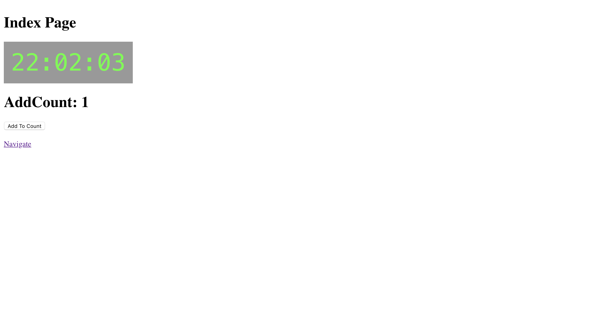

# :fire: warsawjs-workshop-25-myskills :fire:

## Table of Contents :clipboard:

- [Features](#features)
- [What you can learn](#what-you-can-learn)
- [Setup](#setup)

## Features :speedboat:
* :gem: Authorization service (register/login)
* :gem: Notifications service
* :gem: Custom redux middleware
* :gem: Display list of all questions fetched from api
* :gem: Allow to select level and category of questions
* :gem: Display form with random questions
* :gem: Store answers and connect with user account
* :gem: Allow to create new questions by dynamic form based on question type
* :gem: Display users answered questions on profile page


## What you can learn :mortar_board:
* :diamonds: Next.js
* :diamonds: State management with Redux
* :diamonds: Thunk middleware
* :diamonds: Your custom middleware
* :diamonds: Redux-form
* :diamonds: Reselect

## Setup :hammer:
* ```git clone https://github.com/Flixow/warsawjs-workshop-25-myskills.git```
* ```npm install``` or ```yarn install```
* ```npm run dev``` or ```yarn dev```

Then, you should see something like that:


